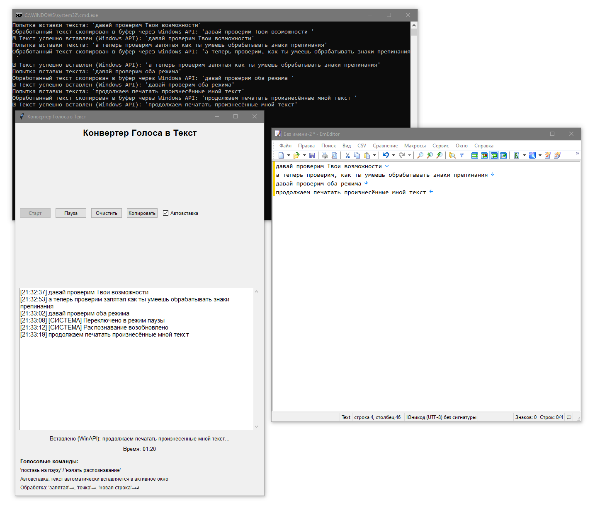

# 🎤 Speech2Text - Умный конвертер голоса в текст

## 🌟 Уникальные возможности

### 🎯 Голосовое управление программой
**Главная особенность:** Программой можно управлять голосом без использования мыши или клавиатуры!

- **"Поставь на паузу"** / **"Пауза"** / **"Останови"** - остановка распознавания
- **"Начать распознавание"** / **"Начать"** / **"Продолжить"** / **"Старт"** - возобновление работы

> 💡 **Почему это важно?** В отличие от большинства аналогов, вам не нужно отвлекаться на интерфейс программы - просто скажите команду и продолжайте работать!

### 🎯 Умная вставка текста
**Распознанный текст автоматически вставляется точно туда, где находится курсор мыши!**

- Работает в любом приложении: Word, Блокнот, браузер, чат, IDE
- Не нужно переключаться между окнами
- Текст появляется именно там, где вы печатали



---

## 📋 Описание проекта

Speech2Text - это продвинутый конвертер голоса в текст с графическим интерфейсом, разработанный специально для русскоязычных пользователей Windows. Программа использует технологию Google Speech Recognition для высокоточного распознавания русской речи.

## ✨ Основные возможности

### 🎙️ Распознавание речи
- Высокоточное распознавание русской речи
- Работа в реальном времени
- Автоматическая настройка под уровень шума

### 🤖 Автоматическая вставка
- **Умная вставка** - текст вставляется в активное окно
- **Множественные методы** - Windows API, pywinauto, pyautogui для максимальной совместимости
- **Буферизация** - автоматическое копирование в буфер обмена

### 🎯 Обработка пунктуации
Произносите знаки препинания словами - программа автоматически заменит их:
- **"запятая"** → `,`
- **"точка"** → `.`
- **"восклицательный знак"** → `!`
- **"вопросительный знак"** → `?`
- **"двоеточие"** → `:`
- **"точка с запятой"** → `;`
- **"тире"** → ` - `
- **"новая строка"** → переход на новую строку
- **"скобка открывается"** → `(`
- **"скобка закрывается"** → `)`
- **"кавычка"** → `"`

### 📊 Дополнительные функции
- **Таймер сессии** - отслеживание времени работы
- **История текста** - все распознанные фразы с временными метками
- **Копирование** - быстрое копирование всего текста
- **Очистка** - мгновенная очистка рабочей области
- **Настройки** - возможность отключить автовставку

## 🚀 Быстрый старт

### Системные требования
- Windows 10/11
- Python 3.7+ (опционально, если используете готовые батники)
- Микрофон
- Интернет-соединение (для Google Speech API)

### Установка

1. **Клонируйте репозиторий:**
```bash
git clone https://github.com/yourusername/speech2txt.git
cd speech2txt
```

2. **Автоматическая установка:**
```bash
setup.bat
```
Этот скрипт автоматически:
- Создаст виртуальное окружение Python
- Установит все необходимые зависимости

3. **Запуск программы:**
```bash
run.bat
```

### Ручная установка (альтернативный способ)

```bash
# Создание виртуального окружения
python -m venv venv

# Активация окружения
venv\Scripts\activate

# Установка зависимостей
pip install -r requirements.txt

# Запуск
python voice_converter.py
```

## 🎮 Как использовать

### Базовое использование
1. Запустите программу через `run.bat`
2. Нажмите кнопку **"Старт"**
3. Начните говорить - текст будет автоматически распознаваться и вставляться

### Голосовые команды
- Скажите **"поставь на паузу"** чтобы приостановить распознавание
- Скажите **"начать распознавание"** чтобы возобновить работу
- Программа продолжит слушать команды даже в режиме паузы

### Режимы работы
- **С автовставкой** (по умолчанию) - текст вставляется в активное приложение
- **Без автовставки** - текст только копируется в буфер обмена

### Пример использования
```
Вы говорите: "Привет запятая как дела вопросительный знак новая строка Все отлично восклицательный знак"
Результат: "Привет, как дела?
Все отлично!"
```

## 🛠️ Технические детали

### Зависимости
- **speechrecognition** - основная библиотека распознавания речи
- **pyaudio** - работа с микрофоном
- **pyperclip** - управление буфером обмена
- **pyautogui** - эмуляция нажатий клавиш
- **pywin32** - Windows API для надежной вставки текста
- **pywinauto** - автоматизация Windows приложений

### Архитектура
- **Многопоточность** - распознавание речи в отдельном потоке
- **Множественные методы вставки** - резервирование для максимальной совместимости
- **Обработка исключений** - устойчивость к ошибкам сети и микрофона

## 🐛 Решение проблем

### Проблема: Микрофон не работает
**Решение:**
- Проверьте, что микрофон подключен и работает
- Убедитесь, что Python имеет доступ к микрофону
- Перезапустите программу

### Проблема: Текст не вставляется
**Решение:**
- Убедитесь, что курсор находится в текстовом поле
- Попробуйте отключить и включить автовставку
- Проверьте, что активное окно может принимать текст

### Проблема: Плохое качество распознавания
**Решение:**
- Говорите четко и не слишком быстро
- Убедитесь в стабильном интернет-соединении
- Уменьшите фоновый шум

### Проблема: Ошибка установки pyaudio
**Решение:**
```bash
# Для Windows
pip install pipwin
pipwin install pyaudio
```

## 🤝 Участие в разработке

Мы приветствуем вклад в развитие проекта! 

### Как помочь:
1. Сообщайте об ошибках через Issues
2. Предлагайте новые функции
3. Отправляйте Pull Requests
4. Улучшайте документацию

### Планы развития:
- [ ] Поддержка других языков
- [ ] Настраиваемые голосовые команды
- [ ] Интеграция с популярными текстовыми редакторами
- [ ] Режим диктовки для длинных текстов
- [ ] Сохранение сессий

## 📄 Лицензия

Этот проект распространяется под лицензией MIT. Подробности в файле `LICENSE`.

## 👨‍💻 Автор

Создано с ❤️ для упрощения работы с текстом

---

## 🆘 Поддержка

Если у вас возникли вопросы или проблемы:

1. Проверьте раздел [Решение проблем](#-решение-проблем)
2. Создайте Issue в репозитории
3. Опишите проблему максимально подробно

**Полезные команды для диагностики:**
```bash
# Проверка версии Python
python --version

# Проверка установленных пакетов
pip list

# Тест микрофона
python -c "import speech_recognition as sr; print('Микрофон работает!' if sr.Microphone.list_microphone_names() else 'Микрофон не найден')"
```

---

⭐ **Если проект оказался полезным, поставьте звездочку!** ⭐